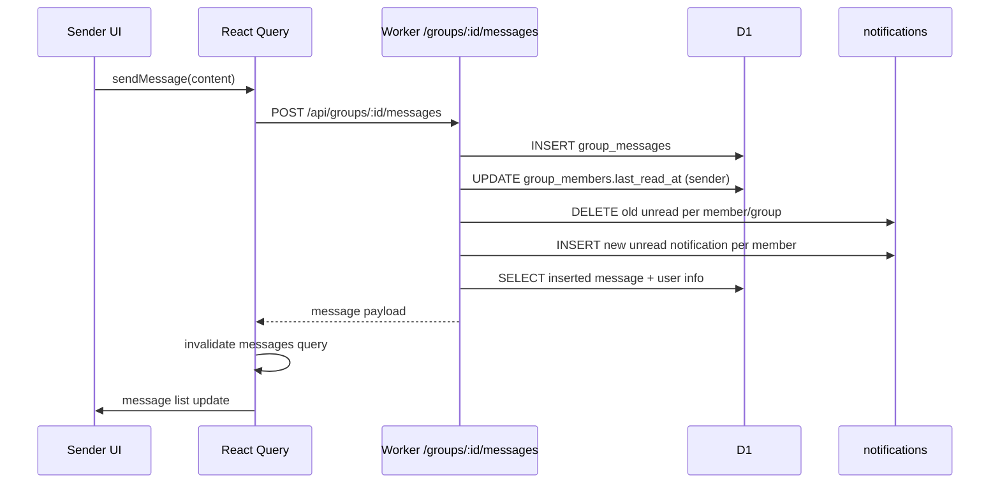
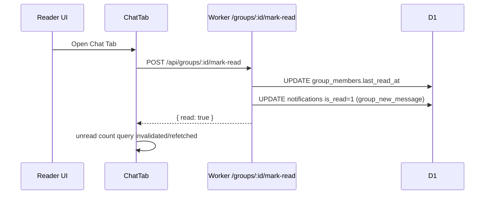

# BookShelf 채팅(Chatting) 시스템 상세 디자인 분석

작성일: 2026-04-27  
대상 범위: 독서 모임 그룹 채팅(메시지 송수신, 읽음 처리, 알림 연동, 프론트 UI/상태)

관련 문서:

- [CHAT_SYSTEM_ANALYSIS_AND_PROMPT.md](CHAT_SYSTEM_ANALYSIS_AND_PROMPT.md) — 외부 시스템 설계 기준, Claude 전달 프롬프트, 갭 분석 로드맵

최근 검증 상태(2026-04-28):

- 빌드/타입/린트 통과
- E2E API 테스트 27/27 PASS
- 관리자 API 테스트 스크립트는 `ADMIN_TOKEN` 주입 실행 경로 지원 (기본 관리자 계정 부재 환경 대응)

최신 동기화 메모(2026-05-31):

- 본 문서의 채팅 도메인 설계 본문은 유효하며, 이번 업데이트는 문서 기준일 동기화 목적입니다.
- 동일 시점에 앱 전반에서는 반응형/뷰포트 리팩토링(`svh`, safe-area, `useViewport`)과 ISBN 스캐너 UX 확장(`WishlistPage`)이 반영되었습니다.
- 채팅 API/DB 스키마 자체 변경은 본 업데이트 범위에 포함되지 않았습니다.

---

## 1) 한눈에 보는 현재 설계

현재 채팅 시스템은 **Cloudflare Workers(Hono) + D1(SQLite) + React Query 폴링** 기반의 구조입니다.

- 실시간 전송(WebSocket/SSE) 대신 **주기 폴링(10초)** 으로 새 메시지 동기화
- 메시지 전송 시 서버가 같은 그룹의 타 멤버에게 **서버 알림(notification)** 을 생성
- 사용자가 채팅 탭에 들어오면 `mark-read` 호출로 읽음 처리
- 메시지 목록은 커서(`before`) 기반 과거 메시지 페이지네이션을 사용

핵심 특징:

1. 구현 단순성/운영 단순성 우선
2. 강한 서버 권한 통제(멤버/모임장 권한 확인)
3. 읽음 상태를 메시지 자체가 아니라 `group_members.last_read_at` + 알림 상태로 관리

---

## 2) 시스템 컨텍스트(구성 요소)

## 2.1 백엔드

- 런타임: Cloudflare Workers
- 프레임워크: Hono
- 인증: JWT Bearer (`authMiddleware`)
- 데이터 저장소: D1 (SQLite)
- 레이트리밋: KV 기반 고정 윈도우 방식

채팅 관련 라우터:

- `worker/routes/groups.ts`
  - `GET /api/groups/:id/messages`
  - `POST /api/groups/:id/messages`
  - `DELETE /api/groups/:id/messages/:messageId`
  - `POST /api/groups/:id/mark-read`
- `worker/routes/notifications.ts`
  - `GET /api/notifications`
  - `GET /api/notifications/unread-count`
  - `PATCH /api/notifications/:id/read`
  - `POST /api/notifications/read-all`

## 2.2 프론트엔드

- React + React Router
- 서버 상태: TanStack Query
- 채팅 UI:
  - `src/app/components/groups/ChatTab.tsx`
  - `src/app/components/groups/GroupDetailView.tsx`
- API 어댑터:
  - `src/lib/api.ts` (`groupsApi.getMessages/sendMessage/deleteMessage/markRead`)
- 채팅 알림 카운트/패널:
  - `src/hooks/useGroups.ts` (`useNotificationUnreadCount`, `useMarkAllNotificationsRead` 등)
  - `src/app/components/navigation/TopBar.tsx`
  - `src/app/components/ui/NotificationPanel.tsx`

---

## 3) 데이터 모델 상세

채팅과 직접 연관된 테이블은 아래와 같습니다.

## 3.1 `group_messages`

출처: `worker/db/migrations/0008_groups_and_sharing.sql`

- 컬럼
  - `id` TEXT PK
  - `group_id` FK -> `groups.id`
  - `user_id` FK -> `users.id`
  - `content` TEXT
  - `created_at` TEXT
- 인덱스
  - `idx_gmsgs_group(group_id, created_at)`

의미:

- 특정 그룹의 메시지 타임라인 조회 최적화
- `created_at DESC` 조회 + `before` 커서 조건에 맞춘 구조

## 3.2 `group_members`

출처: `0008_groups_and_sharing.sql`, `0010_group_approval_notifications.sql`

- 기본 컬럼
  - `group_id`, `user_id`, `role(leader/member)`, `joined_at`
  - `UNIQUE(group_id, user_id)`
- 추가 컬럼(0010)
  - `status` (`pending`/`approved`, 기본 `approved`)
  - `last_read_at` (채팅 읽음 시각)

의미:

- 채팅 접근 제어(승인 멤버만)
- 읽음 기준 시각 저장

## 3.3 `notifications`

출처: `0010_group_approval_notifications.sql`

- 컬럼
  - `id`, `user_id`, `type`, `title`, `body`, `group_id`, `is_read`, `created_at`
- 인덱스
  - `idx_notif_user(user_id, is_read, created_at DESC)`
  - `idx_notif_group(user_id, type, group_id, is_read)`

의미:

- 그룹 채팅 새 메시지 알림(`type='group_new_message'`) 전달
- 미읽음 카운트 및 목록 API의 조회 성능 확보

---

## 4) API 설계 및 책임

## 4.1 메시지 조회 `GET /api/groups/:id/messages`

동작:

1. JWT 인증
2. 멤버십(`approved`) 확인
3. `before` 커서 있으면 이전 메시지 필터
4. `created_at DESC` + `LIMIT`
5. 사용자 프로필 정보 조인(`user_name`, `avatar_url`, `profile_emoji`)

프론트 측 정렬 전략:

- 서버는 내림차순 반환
- 클라이언트가 `reverse` 하여 화면에는 시간 오름차순으로 출력

## 4.2 메시지 전송 `POST /api/groups/:id/messages`

동작:

1. JWT 인증 + 멤버십 확인
2. 레이트리밋(분당 30회)
3. 입력 검증(zod) + HTML 태그 제거(`stripHtml`)
4. `group_messages` INSERT
5. 발신자 `last_read_at` 갱신
6. 타 승인 멤버마다 unread 채팅 알림 갱신
   - 기존 unread `group_new_message` 삭제
   - 최신 메시지 기반 새 알림 INSERT
7. 방금 저장한 메시지를 조인 조회 후 반환

설계 포인트:

- "그룹당 사용자당 unread 채팅 알림 1개" 정책으로 알림 폭증 방지

## 4.3 메시지 삭제 `DELETE /api/groups/:id/messages/:messageId`

- 모임장(leader)만 삭제 가능
- 하드 삭제

## 4.4 읽음 처리 `POST /api/groups/:id/mark-read`

동작:

1. `group_members.last_read_at = now`
2. 해당 그룹의 unread 채팅 알림 `is_read=1`

효과:

- 알림 배지 즉시 감소
- 채팅 탭 진입 시 미읽음 소거

---

## 5) 프론트 상태/렌더링 설계

## 5.1 데이터 페칭

`useGroupMessages(groupId)`:

- `useInfiniteQuery`
- 페이지 크기 50
- `before` 커서 기반 페이징
- `refetchInterval: 10_000` (백그라운드 폴링 비활성)

## 5.2 ChatTab UX 동작

- 탭 진입 시 `markRead.mutate()` 호출
- 새 메시지 길이 증가 시 하단 자동 스크롤
- 최상단 도달 시 과거 메시지 로딩(스크롤 위치 복원)
- 엔터 전송, 전송 중 버튼 비활성
- 날짜 구분선/시간 라벨/연속 메시지 그룹화
- 모임장에게만 삭제 버튼 노출

## 5.3 상단 알림 배지 연동

- `useNotificationUnreadCount`로 서버 unread count 조회
- TopBar 벨 오픈 시 서버 `read-all` 호출 가능(최근 수정 반영)
- 채팅 `mark-read`와 알림 패널 `read-all`이 함께 unread를 동기화

---

## 6) 핵심 시퀀스

## 6.1 메시지 전송 시퀀스

## 6.2 채팅 탭 진입 시 읽음 처리

---

## 7) 보안/정합성 설계

현재 반영된 통제:

1. 인증: 모든 채팅 API JWT 필요
2. 권한: 멤버십/리더십 서버 재검증
3. 입력 검증: zod 스키마(min/max)
4. XSS 완화: 메시지/피드백 `stripHtml`
5. 남용 방지: 메시지/피드백 rate-limit

정합성 특성:

- 메시지 저장 + 알림 생성은 코드상 순차 처리
- 다중 멤버 알림 생성은 `db.batch`로 묶어 실행
- 알림 dedup 정책으로 동일 그룹 unread 알림 1개 유지

---

## 8) 성능/확장성 분석

강점:

- 현재 트래픽 규모에서 운영 단순성 높음
- D1 인덱스가 주요 조회 패턴과 정렬 패턴에 부합
- 폴링 간격(10초)과 페이지 단위 로드로 DB 부하를 제한

한계:

1. 실시간성 한계
   - 폴링 구조라 평균 지연이 폴링 주기에 종속
2. 고트래픽 시 비용
   - 활성 사용자가 늘면 폴링 요청 수 선형 증가
3. 키 기반 레이트리밋 단순성
   - IP 기반이라 NAT/공유망에서 오탐 가능
4. 메시지 삭제 정책
   - 하드 삭제라 감사 추적/복구 어려움

---

## 9) 관찰된 설계/문서 불일치

1. `GET /api/groups` 주석에는 "인증 불필요"라고 적혀 있으나, 실제로는 `authMiddleware` 적용
2. 일부 라우트 주석의 HTTP 메서드 설명이 구현과 불일치(예: notifications 주석의 PATCH/POST 표기)

권장:

- 주석/문서와 구현을 일치시켜 운영 혼선을 줄일 것

---

## 10) 개선 제안(우선순위)

## P0 (단기)

1. 그룹 목록 인증 정책 명확화
   - truly public로 운영할지, 인증 필수로 유지할지 결정 후 코드/주석 동기화
2. 채팅 알림/읽음 흐름 E2E 테스트 강화
   - "전송 -> 수신 unread 증가 -> 탭 진입 unread 감소" 시나리오 자동화

## P1 (중기)

1. 실시간 채널 도입 검토
   - Cloudflare Durable Objects + WebSocket/SSE
2. soft delete 도입
   - 메시지 삭제 시 `deleted_at` 마킹 + 표시 대체
3. 읽음 모델 고도화
   - 필요 시 per-message read receipt 확장

## P2 (장기)

1. 관측성 강화
   - 메시지 전송/지연/실패율, 알림 큐 길이 대시보드화
2. 멀티 리전/대규모 트래픽 대비 전략 수립

---

## 11) 운영 체크리스트

릴리즈 전 검증 항목:

1. 멤버가 아닌 사용자의 메시지 조회/전송이 403인지
2. 모임장이 아닌 사용자의 메시지 삭제가 403인지
3. 메시지 전송 레이트리밋이 429로 동작하는지
4. 채팅 탭 진입 시 unread count 감소가 즉시 반영되는지
5. 무한 스크롤에서 중복/누락 없이 과거 메시지가 연결되는지

---

## 12) 결론

현재 채팅 시스템은 **안정적 CRUD + 알림 연동 + 폴링 기반 준실시간 UX**를 목표로 설계되어 있으며, 권한/검증/레이트리밋이 기본적으로 잘 갖춰져 있습니다.  
다만 트래픽 증가와 실시간성 요구가 커질 경우, 폴링 구조에서 실시간 채널 기반 구조로의 진화가 필요합니다.
